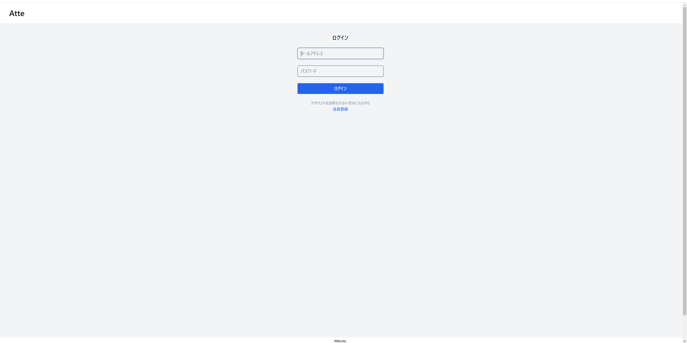
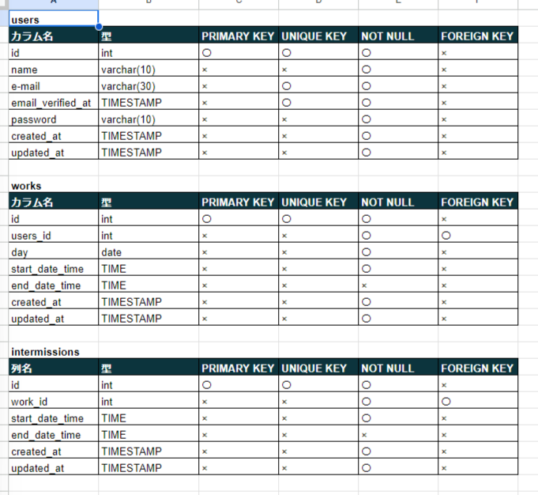

# アプリケーション名
Atte（アット）

**概要説明**

ある企業の勤怠管理システム
## 作成した目的
人事評価のため
## アプリケーションURL
http://localhost/
## 他のリポジトリ
なし
## 機能一覧
・会員登録

・ログイン

・ログアウト

・勤務開始

・勤務終了

・休憩開始

・休憩終了

・日付別勤怠情報取得

・ページネーション
## 使用技術
**フレームワーク**

Laravel Framework 8.83.27

**言語**

PHP

**DB**

MySQL
## テーブル設計

## ER図

## 環境構築
**GitHub　URL**

https://github.com/noihora/Practice_learn_ver3t-form.git

**クローン**

git clone git@github.com:noihora/Practice_learn_ver3t-form.git
